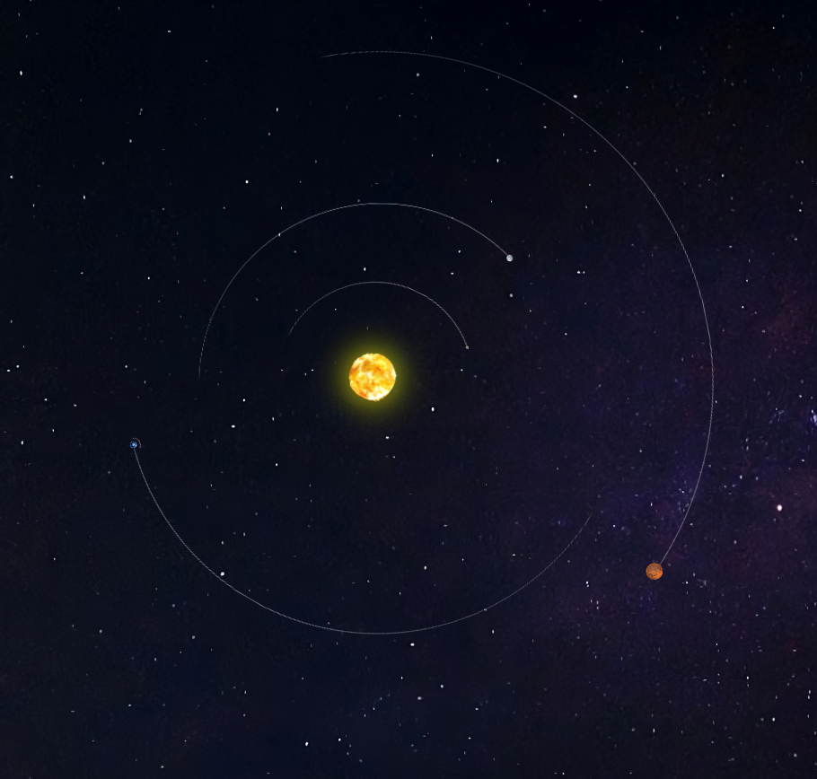

# Inner Solar System Web Page

Welcome to the Inner Solar System Web Page! Explore our solar system's inner planets - the Sun, Mercury, Venus, Earth, and Mars - in an interactive and visually engaging way. Each planet includes links to NASA's planetary overview pages for more information.

**[Launch Inner Solar System Web Page](https://nani8501.github.io/solar.github.io/)**

## Preview

## Features

- Interactive planetary orbits.
- Hover effects for additional information.
- Links to NASA's planetary overview pages for more details.

## Usage

1. Visit the web page using the following link: [Inner Solar System Web Page](https://nani8501.github.io/solar.github.io/).

2. Explore the inner solar system by clicking on the planets and the Sun.

3. Use the hover effects to interact with some planetary elements and get more information.

## Deployment

The Inner Solar System Web Page is deployed and accessible online. You can access it by clicking [here](https://nani8501.github.io/solar.github.io/).

## Credits

- Planetary images and information sourced from [NASA Solar System Exploration](https://solarsystem.nasa.gov/).

## About the Author

This web page was created by [Your Name].

## License

This project is licensed under the MIT License - see the [LICENSE](LICENSE) file for details.
